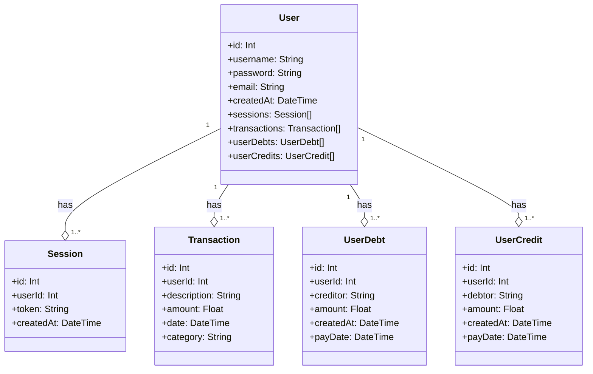

# coin-manager-back

Back-end for coin manager, a personal finance app.

## About

coin manager is personal finance management app that provides a simple
way to streamline your finances, tracking your income and expenses

## Diagram Classes



## How to run for development

1. Clone this repository
2. Install all dependencies

```bash
docker-compose up -d postgres
```

```bash
cd back-end
```

```bash
npm i
```

6. Run the back-end in a development environment:

```bash
npm run dev
```

## How to run tests

1. At the root folder of this project, run the two commands below:

```bash
docker-compose -f docker-compose-test.yml up -d
docker-compose -f docker-compose-test.yml logs -f node-test
```

## Building and starting for production

```bash
cd back-end
```

```bash
npm run build
npm start
```

## Running migrations or generate prisma clients

Before running migrations make sure you have a postgres db running based using the comand:

```bash
docker-compose up -d postgres
```

- `npm run dev:migration:run` - run migrations for development environment by loading envs from .env.development file. It uses [dotenv-cli](https://github.com/entropitor/dotenv-cli#readme) to load envs from .env.development file.
- `npm run test:migration:run` - the same, but for test environment

- `npm run dev:migration:generate -- --name ATOMIC_OPERATION_NAME` - generate and run migration and prisma client for development environment by loading envs from .env.development file. Replace `ATOMIC_OPERATION_NAME` by the name of the migration you want to generate.

- `dev:seed` - seed the database with info on the seed.ts file.